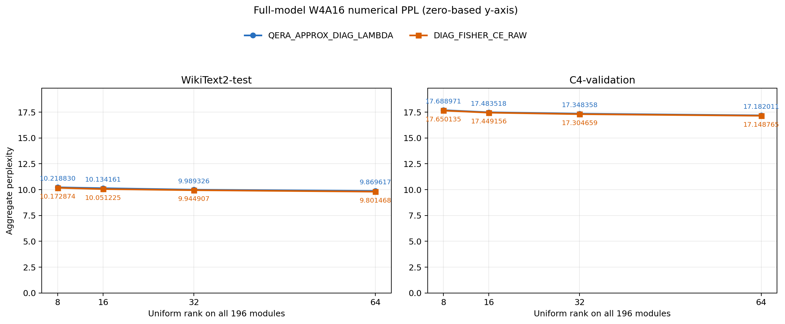
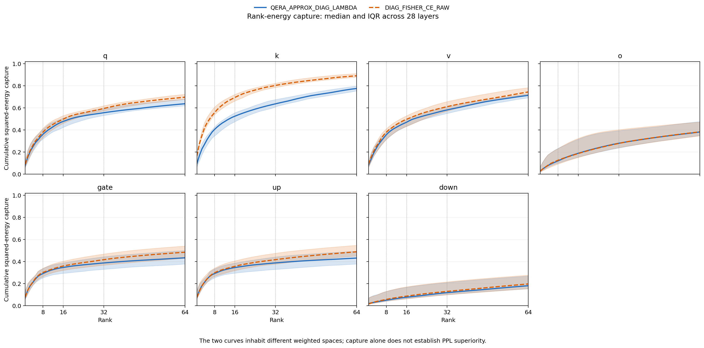

# Legacy diagonal experiment

| File | Content |
|---|---|
| `ppl_summary_wikitext2_full144.csv` | WikiText-2 full-prefix 144 窗口 PPL |
| `rank_comparison_wikitext2.csv` | QERA approximate diagonal 与 diagonal Fisher 的 rank 对比 |
| `ppl_summary_screening_wikitext2_c4.csv` | 32-window WikiText-2/C4 screening |

该实验使用 `INT4_SYM_RTN_G128`，不是 MXINT4-B32。文件用于保存旧对角实验，不与 full-A/full-G MXINT4 六格结果合并统计。

