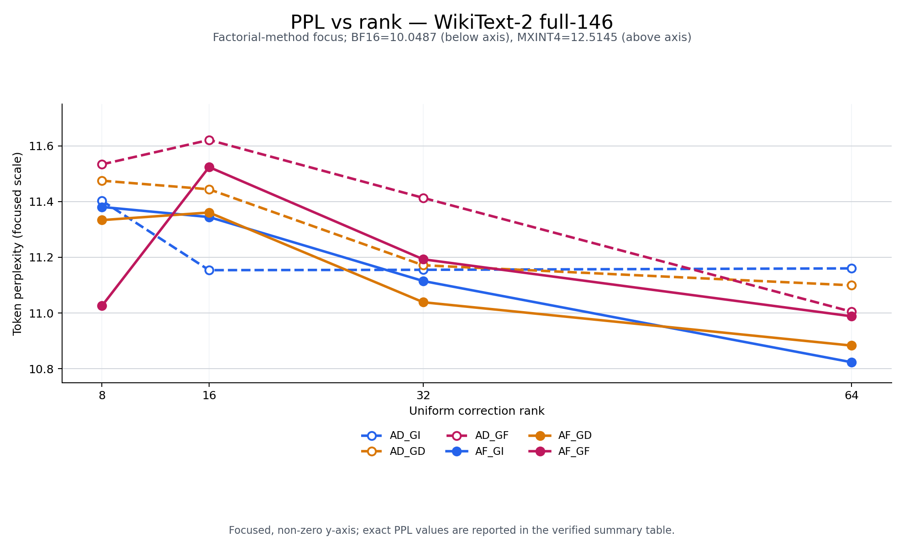
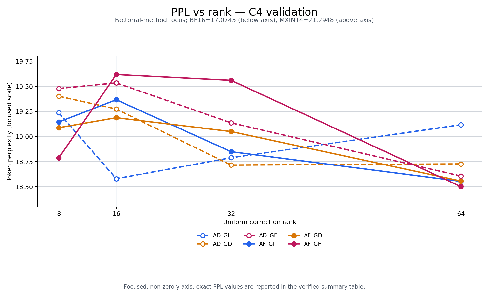
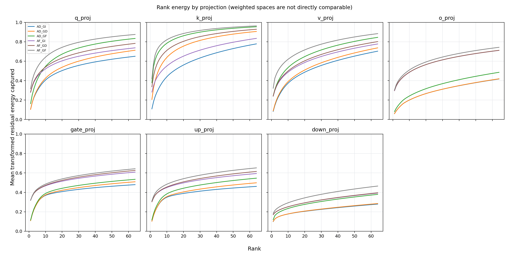

# Qwen2.5-1.5B-Instruct reference

## Protocol

| Item | Value |
|---|---|
| Model | Qwen2.5-1.5B-Instruct |
| Weight format | MXINT4-B32 fake quantization |
| Activation / branch dtype | BF16 |
| Calibration | WikiText-2 train, 256 × 2048 |
| WikiText-2 evaluation | test, 146 × 2048, 298862 prediction tokens |
| C4 evaluation | validation, 32 × 2048, 65504 prediction tokens |
| Ranks | 8, 16, 32, 64 |
| Methods | AD_GI, AD_GD, AD_GF, AF_GI, AF_GD, AF_GF |
| Damping | lambda_A = lambda_G = 1e-4 |
| Full root | symmetric FP64 eigendecomposition |

## Files

- `ppl_summary_wikitext2.csv`
- `ppl_summary_c4.csv`
- `rank_energy_by_projection.csv`
- `figures/ppl_vs_rank_wikitext2_focused.png`
- `figures/ppl_vs_rank_c4_focused.png`
- `figures/rank_energy_by_projection.png`
- `environment.json`
- `qera_alignment.json`

只保留汇总表和图。逐窗口 NLL、量化张量、full A/G 与低秩因子未纳入仓库。

## Figures

